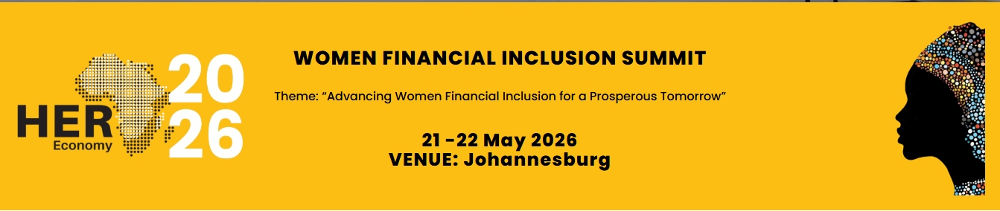

# HER Economy - Women Financial Inclusion Summit



## 📋 Overview

HER Economy is an annual Women, Gender and Financial Inclusion summit hosted by AWFII (African Women Financial Inclusion Initiative), championing African women's financial inclusion. This website serves as the official digital presence for the summit, providing information about the event, agenda, ticketing, and registration.

**Summit Details:**
- **Theme:** "Advancing Women Financial Inclusion for a Prosperous Tomorrow"
- **Date:** 21 - 22 May 2026
- **Venue:** Johannesburg, South Africa

## 📁 Project Structure
```
HerEconomy/
├── index.html # Main homepage
├── css/
│ └── style.css # Main stylesheet
├── js/
│ └── script.js # JavaScript functionality
├── components/
│ ├── header.html # Reusable header component
│ └── footer.html # Reusable footer component
├── images/
│ ├── 2024/12/
│ │ └── her-economy-banner.jpeg
│ └── 2026/03/
│ ├── her_economy_1.jpg
│ ├── her_economy_2.jpg
│ └── her_economy_3.jpg

```
